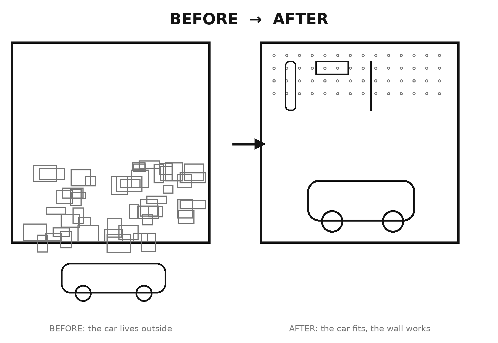

<!-- Introduction · The Garage Reset · draft 2026-06-06 -->

# Introduction

It's Saturday morning. You only need one thing — a screwdriver, the bike pump, the summer
tires. You lift the garage door, and there it is. The pile. The one that grew so slowly you
never quite noticed, until the day it swallowed the whole room. You step over a box, shove a
bike aside, dig for five minutes, give up, and pull the door back down with a sigh. The car
is still in the driveway. Again.

Sound familiar? Then this book was written for you.

And here's the first thing you need to know: **it isn't your fault, and you are not a messy
person.** The garage gets out of hand for one simple reason — a reason that has everything to
do with how houses work and nothing to do with your character. Once you see it (and you will,
in chapter one), the rest gets surprisingly easy.

## Why the garage?

There's no shortage of books about tidying the house. They cover closets, kitchens, and living
rooms, and some of them are genuinely good. But almost all of them stop at the door to the
garage. That's no accident: the garage is hard. It's full of heavy things, sharp things, oily
and flammable things. It's where the tools live, and the tires, the paint, the half-can of
petrol, and a lifetime of "I might need that someday." It's not a closet you clear in fifteen
minutes.

So the garage gets skipped — by the books, and by us. Which is a shame, because the garage is
often the room that steals the most time, the most money, and the most low-grade guilt of any
room in the house.

## A method from the workshop floor

I'm an engineer. I've spent most of my working life in workshops and the engine rooms of ships
at sea — places where a misplaced tool isn't an annoyance but a hazard, and where you learn fast
that order is the only thing that lets the work happen at all. On a rolling deck, every spanner
has one place, and it lives there. The day I really looked at my own garage at home, I saw it was
breaking every rule I'd worked by for twenty years — and that the fix was a method I already knew
by heart. It comes from industry, it's used the world over, and it's far simpler than it sounds.
It's called **5S**, after its five steps:

**Sort. Set in Order. Shine. Standardize. Sustain.**

You don't need to memorize them yet. You just need to know that they build on one another, that
they take one step at a time, and that they work — not only in a gleaming factory, but in an
ordinary suburban garage on a rainy Saturday.

## What you actually get

This is not a book about cleaning the garage once. A big cleanup lasts about three weeks, and
you already know that, because you've probably done one. This is a book about building a
**system** — a garage that keeps itself in order, so you never have to sacrifice another whole
weekend to the same pile.

When you're done, you'll have a garage where the car fits, where you can find any tool in three
seconds, and where ten minutes a week is enough to keep it that way. But most of all, you'll get
back the feeling when you open the door: instead of that small sinking sigh, you'll meet a room
that helps you instead of weighing on you.

## How to use this book

This book is built to be done, not just read. It's a **ten-step program** that takes you from
chaos to a garage that runs itself — and the next chapter lays out the whole map so you can see
the road before you start. The steps follow in order, and every chapter has a box called the
**Weekend Project**: one concrete task you can finish in a weekend, often in a single morning.
You don't have to do it all at once. One or two steps per weekend is plenty, and after about
five weekends you're there. At the very back you'll find the whole program as a checklist you
can tear out and tick off.

You won't need expensive gear or special tools. You'll need this book, a couple of free
mornings, and the willingness to be rid of the pile for good.

So get off the couch. Bring the book. And open the door — this time, we're going to do something
about what's standing behind it.
