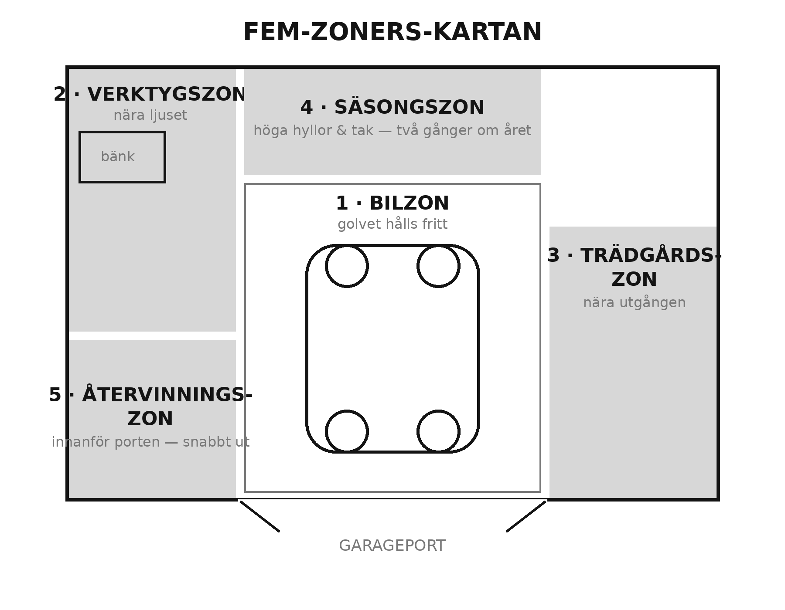

<!-- Kapitel 6 · Del 3 · Städa i Garaget · utkast 2026-06-05 -->

# Zoner som funkar

Nu vänder boken. De första kapitlen handlade om att rensa — att bestämma vad som får
stanna. Från och med nu bygger du i stället: du ger allt som överlevde sorteringen en
bestämd plats. Det här är steget **Systematisera**, och det börjar inte med hyllor eller
krokar. Det börjar med en karta.

Innan du sätter upp en enda skruv i väggen ska du bestämma *var* saker hör hemma. Annars
hänger du upp verktygstavlan på första bästa lediga vägg och upptäcker en månad senare att
den sitter fel.

## Problemet: saker hamnar där det råkar finnas plats

I ett garage utan plan styrs allt av slumpen. Trädgårdssakerna hamnar inte där de är
smidigast — de hamnar där det råkade vara en glugg den dagen du bar in dem. Verktygen
sprids över tre väggar för att ingen plats blev *verktygens* plats. Och eftersom inget hör
någonstans får allt vandra vart som helst.

Resultatet känner du igen: du går fram och tillbaka över hela garaget för en enda enkel
syssla, för det du behöver ligger utspritt. Du hämtar krattan i ett hörn, handskarna i ett
annat och säcken vid porten. Varje moment kostar några extra steg, och de stegen tar du om
och om igen, varje dag.

Lösningen är att sluta tänka i hyllor och börja tänka i zoner. En zon är ett område som
hör ihop med en sorts uppgift, och där allt för den uppgiften bor tillsammans.

## Metoden här: dela garaget i fem zoner

De flesta garage delar sig naturligt i fem zoner. Du behöver inte alla, och du kan slå
ihop dem om utrymmet är litet, men de fem täcker nästan allt som bor i ett garage.

**Bilzonen.** Själva platsen där bilen står, plus det som hör bilen till: spolarvätska,
skrapa, startkablar, en hink. Den här zonen ska hållas mager — det mesta som inte är bilen
ska bort från golvet så att bilen får plats.

**Verktygszonen.** Här bor handverktyg, elverktyg och en arbetsbänk om du har en. Lägg den
nära ett fönster eller bra belysning, för det är här du faktiskt arbetar och behöver se.

**Trädgårdszonen.** Krattor, spadar, slang, kruksaker, gräsklipparens tillbehör. Den hör
nära porten eller den dörr du går ut till trädgården genom — du vill inte bära en lerig
spade genom hela garaget.

**Säsongszonen.** Sommardäck på vintern och vinterdäck på sommaren, jul- och
trädgårdsmöbeldynor, det som bara används halva året. Det får ta de platser som är svårast
att nå — högt upp eller längst in — eftersom du rör det sällan.

**Återvinningszonen.** En liten station nära porten för det som ska ut: kartong, pant,
metallskrot, farligt avfall som väntar på en tur till miljöstationen. Utan en sådan plats
blir "ska slängas" en hög var som helst.

Regeln som binder ihop allt: **placera varje zon där kroppen faktiskt använder den.** Det
du gör ofta ska vara lättast att nå. Det du gör sällan får ta de besvärliga platserna. En
zon på fel ställe känns fel varje dag; en zon på rätt ställe slutar du tänka på.

> **Verkstadsregeln**
> Det du använder ofta ska vara lättast att nå. Det du använder sällan får ta de svåra
> platserna.

## Ett exempel: tre steg för en kvast

En kvinna förstod zoner först när hon tänkte på sin kvast. Den hängde längst in i garaget,
bakom cyklarna. Varje gång hon skulle sopa uppfarten fick hon flytta två cyklar, hämta
kvasten, och flytta tillbaka cyklarna efteråt. Tre extra moment för att sopa.

Hon flyttade kvasten till en krok precis innanför porten — i återvinnings- och utgångszonen,
där den faktiskt användes. Nästa gång tog det två sekunder. Det var ingen stor sak, och det
var precis poängen: en zon på rätt plats tar bort små friktioner du knappt märkt att du levt
med. Tjugo sådana småfriktioner är skillnaden mellan ett garage som tjafsar emot och ett som
hjälper.

## Anpassa zonerna efter ditt garage

De fem zonerna är en mall, inte en lag. Ditt garage kanske inte har en bil alls, eller så är
det så litet att fem zoner inte får plats var för sig. Då slår du ihop. Bil- och
verktygszonen kan dela vägg, och säsongs- och återvinningszonen kan samsas i ett hörn. Det
viktiga är inte att du har just fem rutor, utan att varje sak hör till en zon och att zonen
ligger där uppgiften görs.

Har du i stället ett stort garage eller en kombinerad verkstad, kan en zon behöva delas. Många
hittar att verktygszonen mår bra av att klyvas i två: en för handverktyg vid bänken och en för
de stora elverktygen och maskinerna en bit bort. Låt behovet styra. En zon ska vara så stor som
uppgiften kräver — inte större, inte mindre.

Och tänk på flödet mellan zonerna. De saker du ofta använder tillsammans bör ligga nära
varandra. Bilvården vill vara nära bilen, sladdar och lampor nära bänken. När zoner som hör
ihop ligger granne med varandra slutar du gå i onödan mellan garagets ändar — och det är just
det zonindelningen finns till för.

Ett enkelt sätt att pröva din zonkarta är att tänka igenom en vanlig syssla i förväg. Säg att
du ska tvätta bilen: var står hinken, var hänger svampen, var finns bilschamponet? Om de tre
sakerna ligger i tre olika hörn har du hittat en zon som inte funkar. Gör samma tankeövning
för att klippa gräset, för att laga en cykel, för att ta in veckans återvinning. De sysslor
som känns omständliga avslöjar exakt vilka zoner som behöver flyttas närmare varandra. Du
behöver inte gissa — låt dina egna vanor rita kartan åt dig.

Var inte rädd för att flytta en zon efter någon månad om den visar sig sitta fel. Zonkartan är
ett första utkast, inte ett kontrakt. Det är först när du levt med indelningen ett tag som du
märker att återvinningen borde stått närmare porten eller att verktygen vill vara en meter åt
andra hållet. Sådana justeringar är inte ett tecken på att du gjorde fel — de är en del av hur
ett bra garage växer fram. De flesta zoner hamnar rätt på första försöket, en eller två behöver
flyttas, och sedan ligger de still i åratal.

## Boxar

> **Mått & fakta: mått som håller bilen användbar**
> - En garageplats är ca **3,5 m bred**; ett dubbelgarage ungefär **6 × 6 m**. En bil är ca
>   **1,8–2 m** bred — mindre marginal än det känns.
> - Lämna **75 cm på förarsidan** för att öppna dörren och gå förbi; ca 30 cm räcker på andra sidan.
> - Håll en **fri gång på 1 m** till utgångsdörren — din väg ut vid brand.
> - Kör fram så att du lämnar en **arbetsremsa på 1–1,2 m** bakom bilen.
> - Hyllor framför motorhuven äter djup: håll dem **grunda (≤ 30 cm)**.

> **Helgprojektet: rita zonkartan**
> 1. Ta ett papper och rita garaget ovanifrån, med porten och eventuella fönster och dörrar.
> 2. Märk ut de fem zonerna: bil, verktyg, trädgård, säsong, återvinning.
> 3. Lägg ofta-zoner nära ingångar och bra ljus; sällan-zoner högt upp och längst in.
> 4. Gå en runda i garaget med kartan och kontrollera: känns varje zon logisk där den ligger?
> 5. Spara kartan — nästa kapitel hänger du upp saker, och då följer du den här planen.

> **Säkerhet**
> Lägg aldrig bilzonen så att du måste klättra eller sträcka dig över något tungt för att
> nå verktygen. Och håll en fri gång genom garaget — minst så bred att du kan bära ut något
> stort, eller ta dig ut snabbt om det brinner. Zoner får aldrig blockera vägen till porten.
