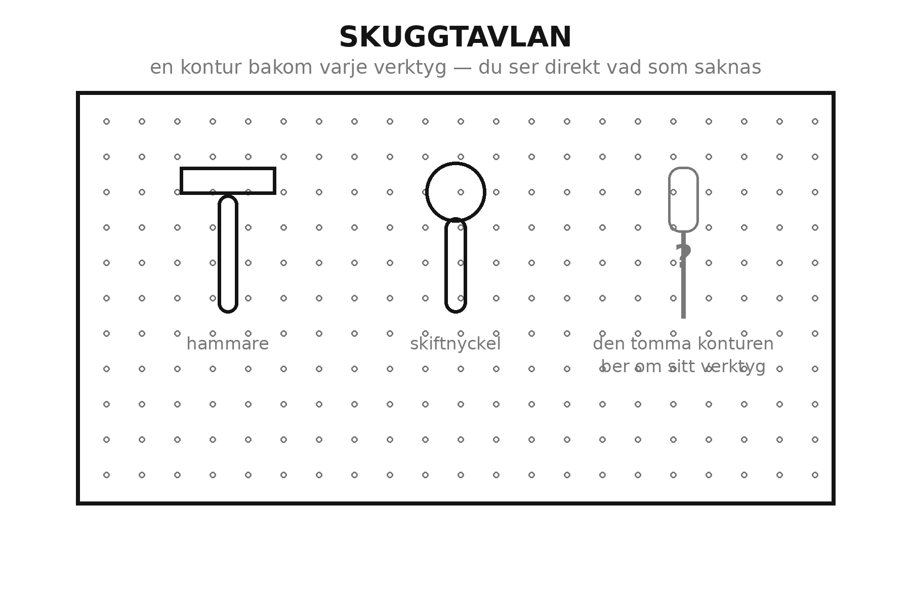

<!-- Kapitel 8 · Del 3 · Städa i Garaget · utkast 2026-06-05 -->

# Hitta på tre sekunder

Sakerna är uppe på väggen och inne på hyllorna. Men **Systematisera** är inte klart förrän
systemet klarar ett enkelt prov: kan du, eller vem som helst i huset, hitta vad som helst på
tre sekunder? Och lika viktigt — kan du lägga tillbaka det lika snabbt?

Ett system som bara du förstår, och bara på en bra dag, är inget system. Det här kapitlet
handlar om att göra ordningen så tydlig att den syns, inte bara minns.

## Problemet: en plats som bara finns i ditt huvud

Du kan ha hängt upp allt prydligt och ändå tappa ordningen inom en månad. Anledningen är att
platsen ofta bara finns i ditt huvud. Du *vet* att silikonsprutan hör näst längst till
höger på tavlan — men ingen annan vet det, och en stressad kväll glömmer du det själv. Då
hamnar saken "ungefär rätt", sedan helt fel, och snart är systemet borta.

Problemet är inte lättja. Problemet är att rätt plats inte är synlig. När det krävs att man
minns var något ska, kommer man förr eller senare att minnas fel. När platsen i stället
syns — pekar på sig själv — lägger man tillbaka rätt utan att tänka.

Hela knepet är att flytta informationen ut ur huvudet och fram på väggen, lådan och hyllan.

## Metoden här: gör platsen synlig

Tre enkla grepp gör nästan vilket garage som helst sökbart på tre sekunder.

**Märk allt slutet.** Varje låda, back och burk som du inte ser rakt igenom ska ha en
etikett på framsidan. Skriv tydligt och stort nog att läsas på en meters håll: "Skruv",
"Ellsladdar", "Bilvård". En omärkt låda är ett gömställe; en märkt låda är förvaring.

**Rita konturer på verktygstavlan.** Måla eller rita en siluett bakom varje verktyg på
tavlan. Nu ser du på en blick både var hammaren hänger och att den saknas när den är borta.
Det kallas skuggtavla, och det är det enskilt bästa knepet för att verktyg ska hamna rätt —
den tomma konturen ber tyst om sitt verktyg tillbaka.

**Gör vanliga saker genomskinliga.** Använd genomskinliga backar eller öppna hyllfack för
det du tar ofta, så att innehållet syns utan att du öppnar något. Det du ser tar du; det du
måste leta efter glömmer du att du har.

**Samla smått i grupper.** Skruv, spik, plugg och beslag är omöjliga att hålla ordning på en
och en. Samla dem i små, märkta burkar eller fack efter typ och storlek, så att "rätt skruv"
är en plats och inte en jakt. En enda låda full av blandat smått är ett av de vanligaste
gömställena i ett garage — bryt upp den i märkta fack och den slutar svälja din tid.

Och så det avgörande provet: **lägga-tillbaka-testet.** Ett system bedöms inte på hur lätt
det är att hitta en sak, utan på hur lätt det är att lägga tillbaka den. Är det svårare att
hänga tillbaka mejseln än att slänga den på bänken, kommer den att hamna på bänken. Gör
returvägen kortast, så håller ordningen sig själv.

Tänk efter var det brukar gå snett hemma hos dig. Nästan alltid är det vid återlämningen, inte
vid letandet. Du hittar saken när du behöver den — men i farten efteråt, med händerna fulla,
blir den liggande "tills sen". Varje gång du gör returvägen ett snäpp kortare, en krok närmare
där saken används, vinner du den striden lite mer. Ett bra system gör det lättare att lägga
tillbaka än att låta bli.

Märkningen behöver inte vara fin för att vara bra. En bit tejp och en tydlig text slår en
prydlig etikett som aldrig blir gjord — det viktiga är att det står något läsbart på
framsidan, inte att det är snyggt. Börja enkelt och uppgradera sedan om du vill. Och var
konsekvent med hur du namnger: kalla lådan "Skruv", inte ibland "Skruv" och ibland "Beslag
och smått", för ett namn som driver gör märkningen lika rörig som högen den skulle ersätta.
Ett system håller på sin tydlighet, och tydlighet är en vana lika mycket som ett knep — ju
mer förutsägbart du märker, desto mindre behöver du tänka för att hitta rätt.

> **Verkstadsregeln**
> Ett system mäts inte på hur lätt det är att hitta — utan på hur lätt det är att lägga
> tillbaka.

## Ett exempel: barnen hittade hammaren

En pappa märkte att hans nyordnade garage höll sig prydligt — tills någon annan behövde
något. Då revs det upp, för bara han visste var allt fanns. Han satte upp en skuggtavla med
konturer och märkte alla lådor stort och tydligt.

Skillnaden kom på ett oväntat sätt: hans tonåringar började själva lägga tillbaka verktyg
rätt. Inte för att de plötsligt blivit ordningssamma, utan för att den tomma konturen visade
exakt vart hammaren skulle, och den märkta lådan sa exakt vad som bodde där. Ordningen
slutade vara hans privata kunskap och blev något hela huset kunde läsa av direkt.

Det är värt att dröja vid varför just synlighet förändrar beteende. När rätt plats syns blir
fel handling jobbigare än rätt handling: att lägga hammaren på en tom kontur är det naturliga,
och att slänga den på bänken bredvid den tomma konturen känns plötsligt fel på ett sätt det
inte gjorde förut. Du behöver inte be någon hålla ordning. Du har byggt ett rum som tyst ber om
det självt, och som tackar ja varje gång en sak hamnar rätt.

Det syns också tydligast när något fattas. En tom kontur på tavlan säger på en blick att
hammaren är utlånad eller bortglömd någonstans, medan en rörig vägg aldrig avslöjar vad som
saknas förrän du står och letar efter det. Ett system som visar sina egna luckor är ett system
som lagar sig självt, för du ser problemet medan det fortfarande är litet — en enda sak på fel
plats, inte tjugo. Det är skillnaden mellan att märka att mjölken är slut när det står en tom
plats i kylen och att upptäcka det först när du redan hällt upp flingorna. En tydlig plats
talar om både vad som finns och vad som fattas, och båda beskeden gör garaget lättare att hålla
i ordning. Synlighet är därför inte bara prydligt — det är själva mekanismen som gör att
ordningen sköter en del av sig själv.

## Boxar

> **Mått & fakta: skuggtavlan**
> - Standardpegboard är **6 mm board med hål ca 25 mm isär**, på **~12 mm avstånd** från väggen
>   så krokarna sitter. Tunn 3 mm board svackar — använd 6 mm.
> - Tunga verktyg drar ut pegboard-krokar — häng dem på **fransk list** eller metallskena.
> - Smått i **fackback märkt efter storlek** ("4 × 30 mm skruv"), sorterat efter typ och längd.

> **Helgprojektet: gör en zon sökbar**
> 1. Välj en zon — verktygszonen är den tacksammaste att börja med.
> 2. Märk varje sluten låda och burk med stor, läsbar text på framsidan.
> 3. Rita konturer bakom verktygen på tavlan så att varje sak har en synlig plats.
> 4. Byt ut minst en ogenomskinlig back mot en genomskinlig för det du tar ofta.
> 5. Gör lägga-tillbaka-testet: ta tre saker och lägg tillbaka dem. Gick det på tre
>    sekunder? Annars korta returvägen tills det gör det.

> **Verkstadsregeln**
> Det du ser, tar du. Det du måste leta efter, glömmer du att du har. Gör innehållet synligt.
