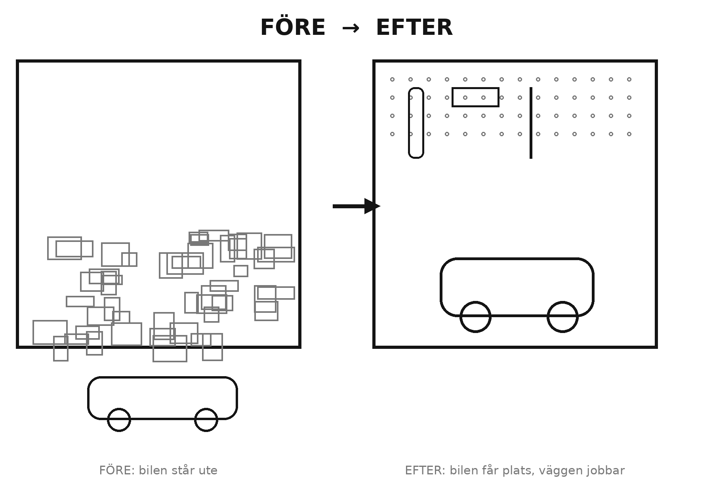

<!-- Inledning · Städa i Garaget · utkast 2026-06-06 -->

# Inledning

Det är lördag förmiddag. Du ska bara hämta en skruvmejsel, eller cykelpumpen, eller
sommardäcken. Du öppnar garageporten — och där står den. Högen. Den som vuxit så långsamt
att du knappt märkt det, tills den en dag fyllde hela rummet. Du kliver över en kartong,
flyttar en cykel, letar i fem minuter, hittar inte det du sökte, och stänger porten igen
med en suck. Bilen står ute. Igen.

Känner du igen dig? Då är den här boken skriven för dig.

Och det första du ska veta är det här: **det är inte ditt fel, och du är inte en rörig
människa.** Garaget blir stökigt av en enda enkel anledning, en anledning som har med hur
hus fungerar att göra och ingenting med din karaktär. När du förstår den — och det gör du
redan i första kapitlet — blir resten förvånansvärt lätt.

## Varför just garaget?

Det finns gott om böcker om att städa hemma. De handlar om garderober, kök och vardagsrum,
och flera av dem är riktigt bra. Men nästan alla stannar vid tröskeln till garaget. Det är
inte konstigt: garaget är svårt. Här finns tunga saker, vassa saker, oljiga och brandfarliga
saker. Här bor verktyg, däck, färg, bensin och en livstid av "kanske behöver jag det". Det är
inte en garderob man rensar på en kvart.

Så garaget lämnas därhän — av böckerna, och av oss. Och det är synd, för garaget är ofta det
rum som stjäl mest tid, mest pengar och mest dåligt samvete av alla rum i huset.

## En metod från verkstadsgolvet

Jag är ingenjör. Jag har tillbringat större delen av mitt yrkesliv i verkstäder och i
maskinrummen på fartyg till sjöss — platser där ett felplacerat verktyg inte är en irritation
utan en fara, och där man snabbt lär sig att ordning är det enda som gör att arbetet alls blir
gjort. På ett rullande däck har varje nyckel en plats, och där ligger den. Den dag jag på allvar
tittade på mitt eget garage hemma såg jag att det bröt mot varje regel jag arbetat efter i tjugo
år — och att lösningen var en metod jag redan kunde utantill. Den kommer från industrin, används
av proffs över hela världen, och är enklare än den låter.

Den här boken tar med sig den metoden hem till ditt garage, översatt till vanlig svenska och
till fem ord som alla råkar börja på S:

**Sortera. Systematisera. Städa. Standardisera. Säkra.**

Du behöver inte minnas dem nu. Du behöver bara veta att de bygger på varandra, att de tar
ett steg i taget, och att de fungerar — inte bara i en glänsande industrihall, utan i ett
helt vanligt villagarage en regnig lördag.

## Vad du faktiskt får

Det här är ingen bok om att städa garaget en gång. En storstädning håller i tre veckor, och
det vet du redan, för du har nog gjort en. Det här är en bok om att bygga ett **system** —
ett garage som håller ordningen åt dig, så att du aldrig mer behöver offra en hel helg på
samma hög.

När du är klar har du ett garage där bilen får plats, där du hittar vilket verktyg som helst
på tre sekunder, och där tio minuter i veckan räcker för att hålla allt på plats. Men mest av
allt får du tillbaka känslan när du öppnar porten: i stället för den där lilla sjunkande
suckan möts du av ett rum som hjälper dig i stället för att tära på dig.

## Så här använder du boken

Boken är byggd för att göras, inte bara läsas. Den är ett **program i tio steg** som tar dig
från kaos till ett garage som sköter sig självt — och Programmet som följer lägger ut hela kartan
så att du ser vägen innan du börjar. Stegen följer på varandra i ordning, och i varje kapitel
hittar du en ruta som heter **Helgprojektet** — en konkret uppgift du kan bli klar med på en
helg, ofta på en förmiddag. Du behöver inte göra allt på en gång. Ett eller ett par steg per
helg räcker, och efter ungefär fem helger är du i mål. Längst bak finns hela programmet som en
checklista att riva ut och bocka av.

Det finns två sätt att använda det som följer. **Kärnan** — programmet i tio steg och dess
kapitel — tar tillbaka ditt garage: bilen in, verktygen hittade, ordningen som håller. För de
flesta är det hela jobbet och hela boken. **Systemet** — Verktygslådan längst bak — är för dig
som gillar att hålla skeppat och klart: en enkel inventering, en verktygsjournal och en
underhållsrytm med brand- och skyddsronder. Det är frivilligt. Om listor och loggar inte är din
grej, hoppa över det med gott samvete; Kärnan står på egna ben.

Du behöver inga dyra prylar och inga specialverktyg — och du behöver ingen skärm. Ingen app,
ingen prenumeration, inget ändlöst sökande, inget wifi: allt finns på de här sidorna, från
början till slut. Du behöver den här boken, ett par lediga förmiddagar, och viljan att äntligen
bli av med högen för gott.

Så res dig ur soffan. Ta med dig boken. Och öppna porten — den här gången ska vi göra något
åt det som står där bakom.
