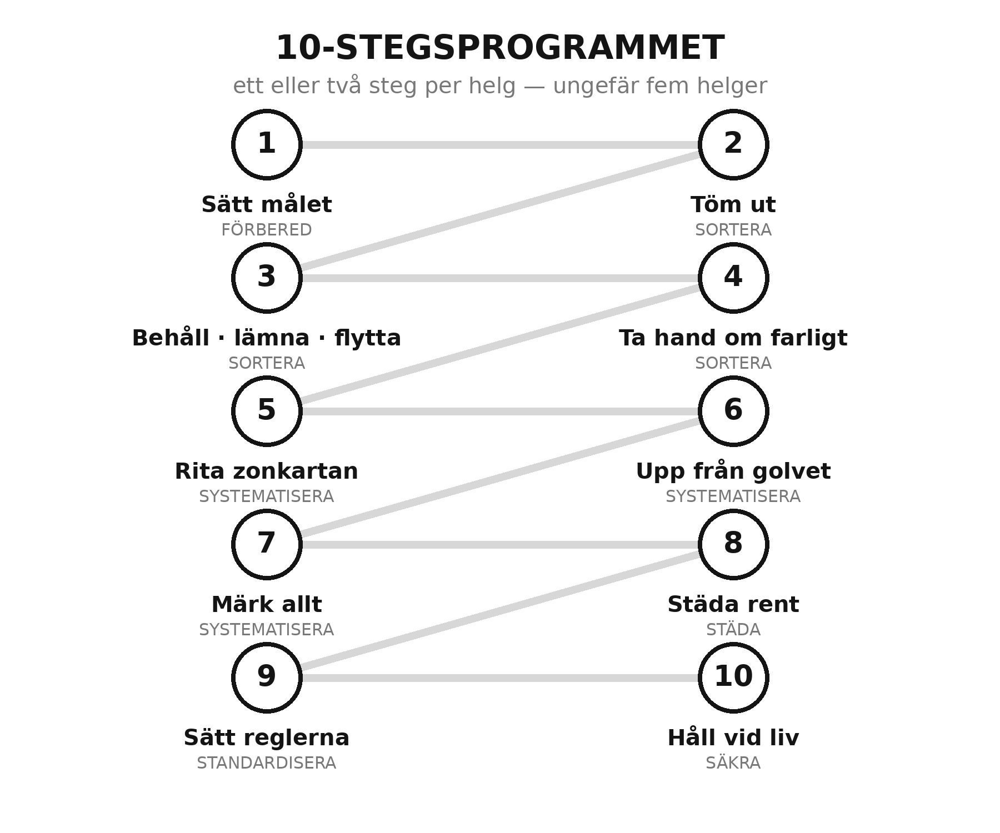

<!-- Programmet · Städa i Garaget · utkast 2026-06-06 -->

# Programmet: 10 steg till ett garage i ordning

Innan vi börjar ska du veta exakt vad det är vi ska lösa, och exakt hur. Det här kapitlet är
bokens karta. Läs det en gång, och kom tillbaka till det när du vill veta var du är.

## Problemet — så här ser det ut

Garaget är det enda rummet i huset som ingen riktigt vet hur man ska få ordning på. Det blir
husets uppsamlingsplats: dit vandrar allt som inte fick plats någon annanstans, en sak i
taget, tills bilen står ute, du inte hittar dina verktyg, och du suckar varje gång du öppnar
porten.

Det beror inte på att du är slarvig. Det beror på att garaget aldrig haft ett **system**. I
köket har varje sak en plats; i garaget har ingenting det, och då blir varje föremål ett litet
uppskjutet beslut. Tusen uppskjutna beslut blir en hög.

Och problemet löser inte sig självt, av tre skäl:

- **Vanliga städböcker hoppar över garaget.** Det är för svårt — tunga, vassa, oljiga och
  brandfarliga saker, inte mjuka kläder.
- **Butikernas tips säljer prylar, inte en plan.** En ny hylla löser inte ett saknat system.
- **En storstädning håller inte.** Den fixar ytan, inte orsaken, så högen kommer tillbaka.

Det du saknar är alltså inte vilja eller ännu en plastback. Det du saknar är en **tydlig
ordning att följa, steg för steg.** Det är precis vad den här boken ger dig.

## Lösningen — programmet i 10 steg

Här är hela vägen från kaos till ett garage som sköter sig självt. Tio steg, i ordning. Du
gör ett eller ett par per helg, och efter ungefär fem helger är du i mål. Varje steg har ett
eget kapitel som visar exakt hur, och en **Helgprojekt**-ruta att göra direkt.

| Steg | Det du gör | Klart när | Kapitel |
|------|-----------|-----------|---------|
| 1 | **Sätt målet.** Fota "före", bestäm varför, sätt en tid. | Du vet ditt mål och har en före-bild. | 1–2 |
| 2 | **Töm och se.** Bär ut allt löst, samla i kategorier. | Allt ligger framme, sorterat i högar av samma slag. | 3 |
| 3 | **Bestäm: behålla, lämna, flytta.** Tre högar, tydliga regler. | Varje sak har fått ett av tre öden. | 4 |
| 4 | **Ta hand om det farliga.** Bensin, färg, kemikalier rätt. | Gifthögen är liten, säker och rätt lämnad. | 5 |
| 5 | **Rita zonkartan.** Dela garaget i zoner efter hur du rör dig. | Du har en karta med fem zoner. | 6 |
| 6 | **Upp från golvet.** Väggar, verktygstavla, hyllor, tak. | Golvet är fritt; allt som kan hänga hänger. | 7 |
| 7 | **Märk och gör sökbart.** Etiketter, konturer, genomskinligt. | Du hittar och återlämnar vad som helst på tre sekunder. | 8 |
| 8 | **Städa rent.** Sopa golvet, torka bänken — sätt baslinjen. | Rent golv och ren bänk är det nya normala. | 1–2 |
| 9 | **Sätt reglerna.** De fyra reglerna som håller ordningen. | Reglerna sitter synligt och gäller hela huset. | 9 |
| 10 | **Håll det vid liv.** Tio minuter i veckan, vår och höst. | Rutinen står i kalendern och är påbörjad. | 10–11 |

## De fem stegen bakom de tio

De tio stegen är de praktiska handgreppen. Bakom dem ligger en beprövad metod i fem delar —
samma metod som proffs använder för att hålla verkstäder i ordning. Du känner igen dem på att
de alla börjar på S, och du möter dem genom hela boken:

- **Sortera** (steg 2–4) — bestäm vad som får stanna.
- **Systematisera** (steg 5–7) — ge allt en bestämd plats.
- **Städa** (steg 8) — gör rent till en baslinje, inte en bedrift.
- **Standardisera** (steg 9) — gör ordningen till förvalet med enkla regler.
- **Säkra** (steg 10) — håll systemet vid liv med en kort rutin.

## Efter de tio stegen

Tre kapitel tar sedan upp särskilda fall som inte är ett vanligt villagarage: **fritidshusets
uthus**, **lägenhetsförrådet** och **att ärva en hel verkstad**. Hoppa dit du känner igen dig
— metoden är densamma, men de platserna har sina egna knep.

Och längst bak ger dig **Verktygslådan** inventeringen, livslängdsjournalen, giftloggen och ett
löpande underhållsprogram — allt gratis att skriva ut — som håller garaget i ordning långt efter
de fem helgerna.

Du har nu hela kartan. Vänd blad, så börjar vi med steg 1.
