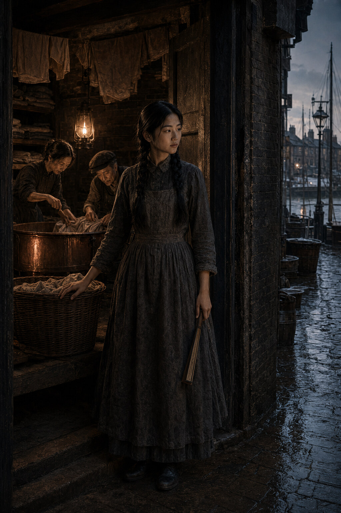

# The Watchman's Daughter

## A Standalone Novel

**N. Johansson**

> Never first. Never for show. Never for payment. Never in anger.
>
> — the rules Wei Zhang taught his daughter

*This is a work of historical fiction. Su Zhang, her family and Dr Reginald Cray
are invented. Elizabeth Stride and Catherine Eddowes were real women. Their
friendship with Su is fictional, and this novel proposes no solution to the
Whitechapel murders.*
