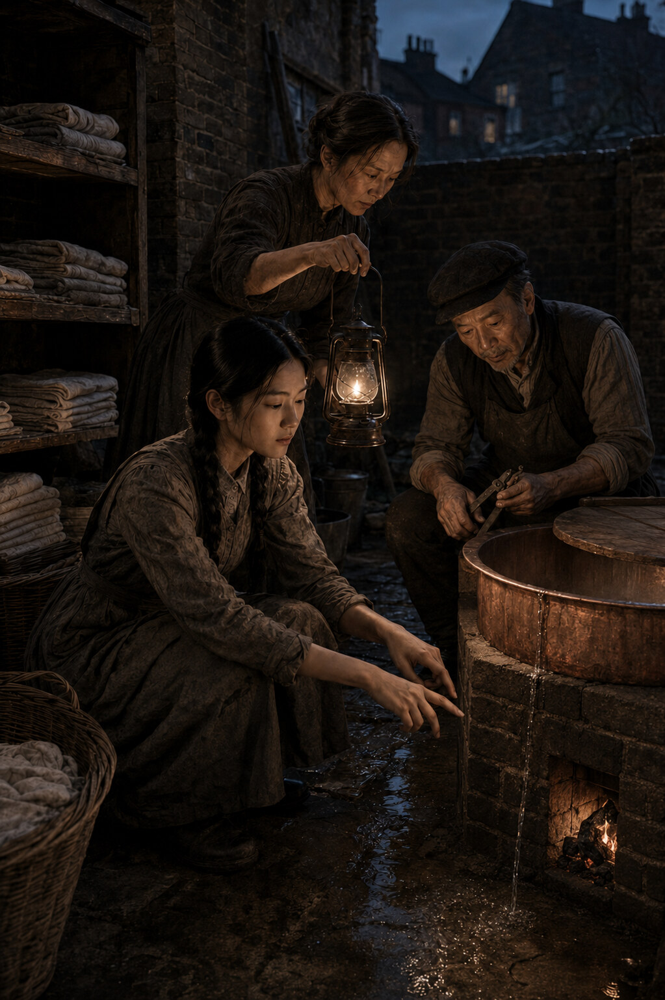

# Chapter One: The Copper

*Limehouse, Monday, 20 August 1888*

The wash-copper begins leaking at twenty minutes past five, before the fire has
properly caught.

Su hears it from the room above: not the ordinary complaint of pipes or the tap
Sau-Ling never quite closes, but a slow strike of water against metal. Three
drops, a pause, then three more. The house has enough recurring noises that each
belongs to someone. Her father's cough crosses the landing before he does. Her
mother's slippers drag only on the left, where the sole is going. The high window
rattles when the wind comes east. This sound belongs to nobody yet, and therefore
gets Su out of bed.

She finds her mother in the yard in her night wrapper, holding a lamp over a dark
line spreading beneath the copper.

It has chosen Monday, Sau-Ling says.

The copper gives another measured drop. It has understood the accounts.

Su crouches and lays two fingers in the wet. Warm already. The seam Wei mended
last winter has opened at one end, no wider than a hair and long enough to matter.
Oakum shows through the pitch like a grey thread pulled from black cloth.

The fire?

Drawn low.

The first sailors' shirts are due at eight. Two boarding houses want sheets by
noon; the Prospect expects its bar cloths before opening; Mrs Bell in Wapping has
sent a note using the word *urgent* three times about a tablecloth no guest will
look at. The Monday bundles occupy the back room in brown-paper ranks, each with
its ticket, each already promised to someone who believes his or her washing is
the only work in London.

Su gets the shallow pan from beneath the mangle and pushes it under the seam.
The water strikes tin instead of stone. The sound becomes brighter and more
annoying.

Your father will say it can be mended.

It can be mended.

He will be pleased you agree.

It cannot be mended before noon.

That will displease him enough to restore the balance.

Sau-Ling goes inside to dress. Su stays crouched, watching the water gather. At
nineteen she has spent more of her life beside this copper than away from it. It
was second-hand when her mother bought it and old when the first owner sold it.
The lid fits only when turned so the dent faces the wall. A pale scar runs down
one side where lye once ate the surface. Last winter the lower seam split, and
Wei, refusing a tinsmith they could not pay, drove oakum into it as though
caulking a boat and covered the repair with pitch. On hot days the yard smells
faintly of a Hong Kong waterfront Su has never seen.

She can put her thumb over the leak and stop it. The instant she lifts it, the
water begins again.

This is not useful, but it is satisfying.

Wei comes down dressed except for his collar, carrying the wooden box in which
he keeps chandlery tools too fine to leave in the shop. He takes in the lamp, the
pan and his daughter with her thumb against the copper.

Move your hand.

Then it will leak.

I have studied the difficulty from here.

She moves it. Water ticks into the pan.

Wei kneels. Ten years ago he would have lowered himself without touching
anything. Now one hand finds the copper's rim and takes some of his weight. The
movement is so ordinary that Su nearly misses it. That, she is beginning to
understand, is how age enters a house: it does not knock; it makes one small use
of the furniture and waits to see who noticed.

His fingers test the seam. Rope and tar have made the tips broad and hard, but
the right forefinger still finds the break at once.

The copper has chosen Monday, Su tells him.

Your mother said that.

She did.

Then why are you saying it again?

Because you did not laugh when she said it.

I heard it from the stairs. It was not better from the yard.

Sau-Ling, buttoning her work dress as she returns, says, Twenty-seven years and
still he believes a joke is improved by inspection.

Wei opens the tool box. Twenty-seven years and still you submit defective work.

The corner of Sau-Ling's mouth moves. Su looks down before either parent catches
her smiling at them. They conduct affection by complaint, as some households do
through embraces or pet names. A stranger might believe the Zhang marriage had
been one long dispute about workmanship. Su knows better. Her father saves the
straightest pieces of kindling because her mother dislikes smoke. Her mother
warms his socks on the copper lid in winter and calls it an efficient use of
heat. Neither has ever mentioned either practice.

Wei scrapes away loose pitch with a narrow blade. His left hand holds the lamp.
The flame trembles once against the copper, stops, then trembles again.

Su takes the lamp from him as though she needs it for her own inspection.

Heat more water in the kitchen, he says. Half the load at a time. Keep this below
the seam.

That gives us three tubs and one stove.

You have counted correctly.

And noon?

Will arrive whether the sheets are clean or not.

This, from Wei, is nearly an admission of defeat.

By six the yard is working around the wounded copper. Sau-Ling sorts and marks.
Su lifts the first wet load from a kitchen tub, linen twisting against her grip,
and feeds it through the mangle. The rollers complain. Water sheets down her
forearms and darkens her sleeves to the elbow. A bundle of sailors' shirts takes
the blue; two sheets require another boil because somebody has mistaken a
lodging-house bed for a place where boots may be worn; Mrs Bell's tablecloth has
one wine mark, three grease marks and no respect for the word urgent.

The work has a sequence that cannot be hurried but can be made to overlap. While
one load heats, another soaks. While Sau-Ling rubs soap into collars, Su turns the
mangle. When the first shirts go to the line, the irons begin heating on the
stove. The leak fills its pan, and every quarter-hour Su empties it back into the
top of the copper, carrying the same water through the same work twice.

At half past six Wei returns from the shop-front with a coil of packing and a
small pot of pitch.

You should open the shutters, Sau-Ling tells him.

The shutters open at seven.

Men are already at the door.

Then they are early.

They are sailors. Early is when the ship throws them out.

A fist confirms this against the front shutter. Someone calls Wei's name, then
calls it again with a different vowel, as if trying several keys in a lock.

Wei remains kneeling by the copper.

Su wipes her hands and goes through the shop. Behind the shutters two men are
silhouetted in the gaps, one broad and one narrow, both smelling through the wood
of river damp and a night not spent sleeping. When she opens the upper half, the
broad man pushes a canvas bundle towards her.

Ship at Blackwall, he says. Sails Thursday. Need these Wednesday.

The ticket tied to the bundle says twelve shirts. The bundle weighs nearer
twenty.

Wednesday costs sixpence extra.

Your father never said so.

My father is repairing the copper you intend to use.

The narrow sailor laughs. The broad one looks past her, expecting the older man
to appear and restore the natural arrangement of trade.

Wei does not appear.

Fourpence, the sailor says.

Six.

Five and you can keep the buttons that come off.

Six, and we sew the buttons back on.

The narrow sailor laughs again, louder. His companion considers Su properly for
the first time. She is slight enough that customers expect the basket to own her
rather than the other way round. The expectation usually lasts until she moves a
wet sheet or refuses a price.

Six, he says.

Su writes the docket, takes the deposit and places the bundle last in the row.
When she returns to the yard, her father has heard every word through the thin
partition.

Wednesday, he says.

Wednesday.

Twenty shirts.

Nineteen. One is trousers pretending.

And the copper?

Will be pleased to learn we have found it employment.

This time Wei does laugh, once, through his nose. Sau-Ling looks at Su over a
collar and gives the smallest possible nod. Sixpence is sixpence. More than that,
the price held.

At seven Wei opens the shop shutters. Morning enters all at once: cart wheels on
West India Dock Road, a horse objecting to its load, dock gates clanging, men
calling across traffic in four languages and swearing in several more. The
Strangers' Home puts out its breakfast smell. A steamer sounds from the river,
low enough to shake the window glass. Across the way, a boy runs with a coil of
rope over one shoulder, late for somebody else's tide.

The copper still leaks. The pan still fills. The shirts still have to be clean by
Wednesday.

Su turns the first docket on the counter to face her and begins the day.
