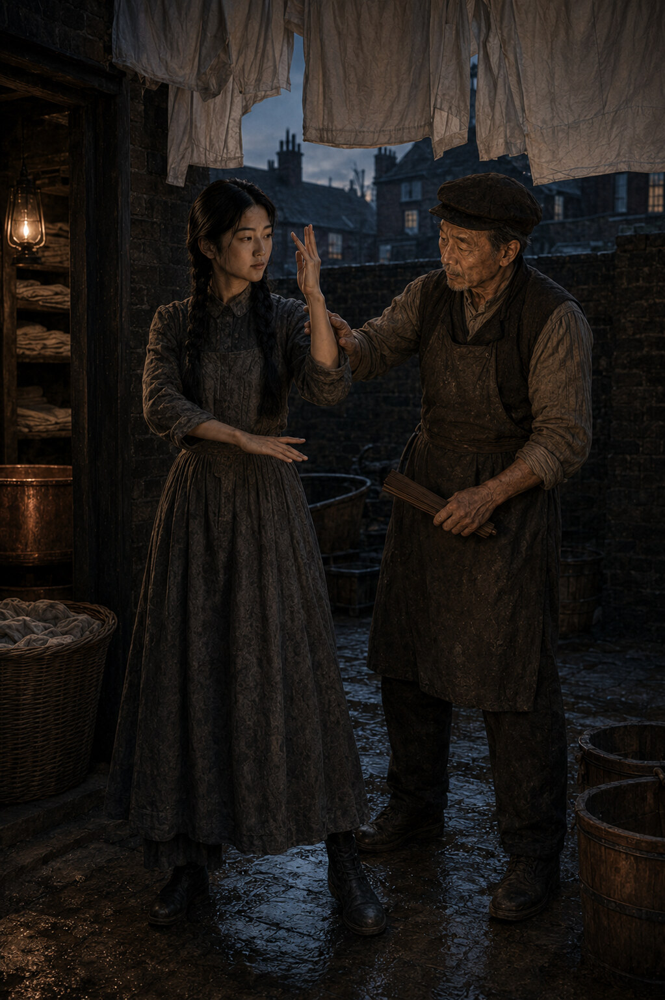

# Chapter Two: Two Languages

The yard belongs to the laundry after six. Before six it belongs to Wei.

He is there when Su comes down on Tuesday, a darker shape inside the blue light,
working through the same form he has worked every morning she can remember. The
copper stands cold behind him while yesterday's repair hardens. Shirts hang over
their heads, pale and still. Beyond the wall, Limehouse is not yet a city so much
as a collection of people coughing in separate rooms.

Su takes her place opposite him.

Late, he says.

The clock has not struck five.

Then the clock is also late.

She settles her feet. The stones are cold through the soles of her shoes. Wei
looks once at the line of her knees, then at her shoulders, and begins.

The first movement is slow enough to embarrass anyone who has learned fighting
from a sailor's story. There are no flying kicks, no cries, nothing that would
earn space in a music hall. Her right hand rises. Her left covers. Weight passes
from one foot to the other without lifting the head. Wei steps in and lays his
forearm against hers.

Listening, he says.

Su closes her eyes.

Through the crossed bones of their arms she feels his weight settle on the rear
foot. His shoulder is empty; the turn will come from the waist. She answers
before it arrives, not stopping the force but lending it a direction that leaves
her standing and him one pace beyond where he intended to be.

The folded fan touches the outside of her knee.

Too narrow.

It was wide enough.

For what happened. Not for what might have happened.

She widens the stance by half an inch.

Again.

The fan has been correcting Zhang knees for longer than anyone living can say.
Plain brown wood, twelve ribs, the paper removed years ago and never replaced. It
was her grandfather's in Canton and then Hong Kong, where it served in the yard
and in the small room beside it in which he set bones. A wrist turned one way to
stop a man could be turned back the other way to restore him. The same wooden rib
that found a weak angle could hold the joint straight while cloth was wound. Her
father says this is why the practice requires manners. Anyone can learn where a
body fails. The question is what sort of person carries the knowledge home.

Wei presses in again. Su reads the shoulder, borrows the weight and turns him.
This time the fan does not touch her.

What are the rules?

She gives them in Cantonese.

Never first. Never for show. Never for payment. Never in anger.

English.

She gives them back in English.

Why twice?

Because a rule you can only say in one language is a rule you only half know.

Why rules?

Because I carry the weapon with me.

Where?

She opens her eyes. He dislikes this part performed like catechism, though he is
the one who made it one.

In my body.

And therefore?

It must have better manners than a knife in a drawer.

Wei nods. The exchange is older than her impatience with it.

At seven, when she was first allowed into the yard, Su believed the rules were a
delay before the important material. At eleven she thought they were protection
against punishment. At fourteen she learned that they were what remained when
there was no time to ask her father what to do.

She had been carrying a basket then too.

It was winter, late enough that the chandlers had lit their windows and early
enough for men still to be unloading the river. Sau-Ling had sent her for lamp
wicks and two pounds of onions. Su came back by the wall behind the cooperage,
where the road narrowed between stacked casks and the railings of a locked yard.
Three boys were waiting there, though not for her in particular. Boys of sixteen
or seventeen, dock-bred, bored, old enough to know the names they were using and
young enough to believe that made no difference.

The first stepped across the opening.

What have you got, China?

Onions.

He had not expected an answer. The other two laughed because he had not expected
one.

Let's see.

They are onions in private as well.

The laugh changed. Su heard it happen and wished, immediately and uselessly, that
she had kept quiet. The first boy took the handle of her basket. She kept hold of
the other side.

Let go.

No.

He pulled. She went with it because the onions cost money. For a moment they
stood like children contesting a toy, his friends offering advice. Then he put
his free hand against her chest and shoved.

That was the beginning.

Years later, when memory had polished the incident into something neater than it
was, Su could still recover the surprise of how little the yard resembled itself
when required in the world. Her feet found wet road instead of level stone. Her
coat caught at the shoulder. The basket occupied one hand. Nothing waited in the
correct place.

But the boy's wrist was still a wrist.

She turned with the pull, stepped outside his foot and let his own effort carry
him across the basket. He struck the casks shoulder first and sat down among the
onions, more astonished than hurt. The second boy came from her left with both
hands wide. Su raised the basket between them. His fingers caught the wicker; she
dropped her weight and turned. The basket became a wheel he had volunteered to
hold. He went over it and landed on his friend.

The third hit her.

This was the portion sailors omitted from their stories: skill did not make a
fist imaginary. His knuckles caught her beside the ear. Light crossed her sight,
white and complete. She lost one shoe and nearly lost the road. Training kept her
chin down; anger brought it back up.

She wanted to hurt him. The wanting was clean, hot and wonderfully simple.

Never in anger.

Her father's voice did not arrive like wisdom. It arrived like an inconvenience.

The boy reached again, encouraged by the blow. Su stepped close enough that his
arm passed uselessly behind her shoulder, placed two fingers at the hinge of his
elbow and turned his wrist until his knees made the decision his pride would not.
He went down slowly, first to one knee and then the other, making a sound of deep
personal objection.

She let go.

He looked at the two boys among the onions, looked at Su, and ran.

The first two recovered enough courage to follow him. One took an onion. Su did
not pursue the theft.

At home, Sau-Ling put a cold spoon against the swelling beside her ear and asked
only whether the lamp wicks had survived. Wei listened to the account without
interrupting. Su waited for praise. She had been struck, outnumbered and still
returned with nearly all the shopping. Praise seemed the minimum reasonable
payment.

Instead he said, Rules.

She recited them in Cantonese.

English.

She recited them in English.

Your stance was too narrow.

You were not there.

Your right shoe is still in the road. I do not need to have been there.

He took her into the yard and corrected her feet for half an hour. Su hated him
for eleven minutes, hated the boys for the full half-hour and hated herself until
morning for having enjoyed the third boy's fear. Only much later did she learn to
translate her father's correction properly: *I am proud of you. The world has
found you. I am frightened it will come again.*

In the present yard, Wei's forearm touches hers once more.

Eyes closed.

They begin the listening exercise. At first there is only pressure: skin, sleeve,
bone. Then the smaller information returns. Front foot weighted. Right shoulder
ready. Breath held too high. Su turns, and he answers, and she answers the answer.
For several exchanges he is the fixed point he has always been.

Then his right grip closes a fraction behind its intention.

The error is tiny. Against anyone else she might not feel it. Against Wei it is a
bell sounded in an empty room.

Su completes the movement without exploiting the opening. His balance returns.
Neither speaks.

Again, he says.

They repeat it. This time his hand is exact.

When the form ends, Wei takes the folded fan and touches it to her elbow.

Too high.

It was not.

It will be tomorrow.

He goes inside to open the shop. Su remains in the yard as the first heat begins
to rise through the repaired copper. She tells herself that a late grip in cold
weather is nothing. The body is not a clock. One error is not a change.

Above her, yesterday's shirts move for the first time in the morning air. On the
stones, her father's footprints cross the wet patch by the copper. The right is
clear. The left has dragged at the toe.

Su bends, wipes the mark away with her sleeve and starts the fire.
