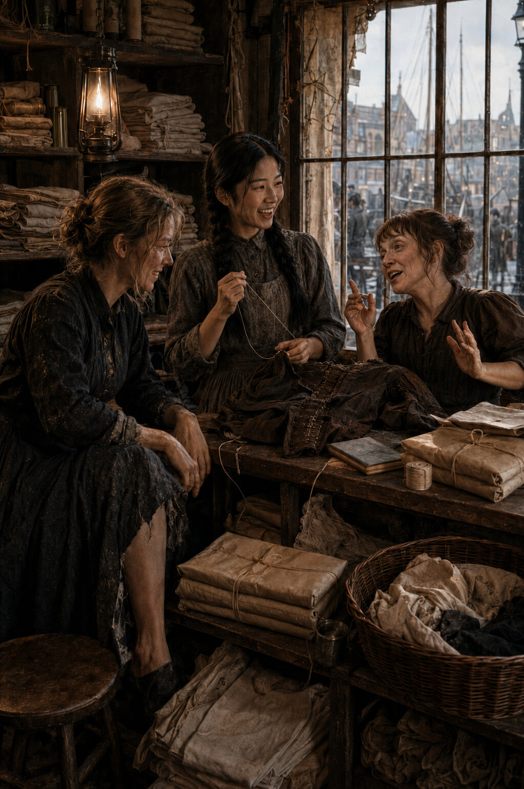

# Chapter Three: Monday Customers

*Monday, 27 August 1888*

Long Liz arrives before the shirts are dry and Kate arrives before Liz can leave.

This is not unusual. Monday customers collect at the laundry as river rubbish
collects at a bend: by no arrangement anyone admits making, held for a while by
the shape of the place. The shop has two stools and room for one. By nine there
are four parcels on the counter, a sailor asleep against the flour bin next door,
and an argument outside about whether a particular cap belongs to a particular
head. Sau-Ling is in the yard. Wei has gone to price lamp oil. Su possesses the
front room and, for the next hour, every difficulty that enters it.

Liz's difficulty is a skirt hem.

She lifts it clear of the floor as she comes in, showing three inches of lining
and a length of stitching that has surrendered from one side to the other.

It caught on a nail, she says.

The tear begins six inches above the hem.

A tall nail.

With five fingers?

London carpentry has become very advanced.

Liz settles onto the customer stool with the dignity of a duchess taking a box at
the theatre. She is tall enough that most chairs seem to have been made after
hearing an inaccurate account of women. At forty-four she remains handsome, when
she chooses to let the world see it. Her hair is dark and curled, her eyes pale.
The English in her mouth has been worked smooth by twenty years of use, but some
words still turn towards Gothenburg when she is tired.

Su examines the tear.

Tomorrow afternoon.

I need it tonight.

Then yesterday afternoon.

You are very severe for a child.

You are very careless for a woman with one good skirt.

It is my only good skirt. The others are honest about what they are.

Liz produces two pennies and a farthing from separate places and sets them on the
counter. Su names a price smaller than the work. Liz names one smaller still.
They meet in the narrow space where both can pretend to have won.

You have the Swedish church today? Su asks.

Tomorrow. Today I have a floor in Poplar and a woman who believes scrubbing
harder will remove the fact that her husband smokes.

Will it?

It has not yet removed the husband.

Su smiles. Liz catches it and looks pleased with herself.

It is easy with Liz in the shop, though not simple. Those are different things.
Easy is the absence of performance. Liz knows what it costs to move a self from
one language into another and discover that some pieces will not pass through.
She does not compliment Su's English. She does not ask whether China has weather.
She does not speak slowly to Wei and loudly to Sau-Ling, as though nationality
were a disorder of the ear. When she asks a question, she waits for the answer
she has actually requested.

The first time they talked about language had been over a torn cuff. Liz searched
for an English word, found it and rejected it.

It means the same thing, she had said, but it does not weigh the same.

Since then they have kept, without deciding to, a list of words that arrive in
English lighter than they left home.

Home, Su says now, pinning the hem.

Liz considers. No. *Home* is greedy in both.

Mother.

The same weight. Different temperature.

Duty.

That one is heavier in English. The English have put iron in it.

Su bites the thread clean. Grief.

Liz's face changes so little that another person might not see it.

Grief is only a noise to me in English, she says. In Swedish it has a floor and
walls.

Su knows what she means. Her father has a word for the work they do before dawn,
a Cantonese word that contains the yard, her grandfather, the fan and the rules.
In English it becomes *practice*, a thin word, a person doing scales badly in the
next room. She has never found a way to tell Liz the original without making it
smaller through explanation.

The bell above the door gives one hopeless jangle and Kate Eddowes comes in under
it singing.

She has the first line before the door closes, a slow quay-side tune about a girl
whose sailor has gone where all sailors in songs go: far enough away to rhyme
with foam. Kate's voice is not good in the church sense. It enters ahead of her,
occupies available surfaces and makes the window glass participate.

Morning, duchess, she says to Su. Long Liz. Didn't know they'd let Swedes this far
east before dinner.

They issue me a pass at Aldgate.

Kate puts a brown-paper parcel on the counter. She is small, quick and dressed in
black that has gone brown at the seams. A fringe sits low on her forehead. There
is always something newly mended about her and something newly coming apart. She
smells of street air, tea and the small dram she will deny if asked.

What is it? Su says.

A triumph of English dressmaking.

What has happened to it?

English dressmaking.

Inside the paper lies a bodice with one sleeve half out and three hooks missing.
The fabric is sound. Kate buys good cloth when she can and then asks it to live
several lives.

Need it by Saturday.

You needed the skirt by last Saturday.

Different Saturday.

All your Saturdays look alike from here.

This one is Kent. Me and John are going hopping. Fresh air, honest wages, and not
a copper in London knowing where to find us.

Liz raises an eyebrow. Honest wages?

I said Kent. I didn't say heaven.

Kate takes the second stool, which means Liz must move her knees and the shop can
no longer be crossed in a straight line. She resumes the song while Su turns the
bodice inside out. The tune reaches the quay, the waiting girl and the first
returning ship. Then it stops.

Go on, Su says.

That's all of it.

You sang the same part last week.

Because it's still the part I know.

What happens to the girl?

If I knew, I'd sing it.

Make something up.

Kate looks offended. You can't lie in a song.

You lie everywhere else.

Exactly. A song deserves standards.

Liz supplies an ending in Swedish, four low lines with a last note that descends
instead of resolving. Kate listens with grave concentration.

What's that say?

The sailor marries somebody in Malmö and the girl inherits his mother's goat.

That's not a song. That's a legal proceeding.

Su laughs. Not the small breath she usually permits customers, but a full laugh
that makes her bend over the bodice and lose the needle for a moment. Kate points
at her as if this proves a case she has been making for years.

There. Knew you had one.

One what?

A human noise. Your mother said you did, but I thought she was protecting trade.

Sau-Ling calls from the yard, I said no such thing.

You said she cried as a baby.

All babies cry. It is their profession.

Su finds the needle and straightens. The laugh remains in her chest, making the
room feel briefly larger than its walls.

People who know her only from the street often call her solemn. Some say proud.
Men who have tried to make her smile have called her cold when they failed, as
though expression were a service a young woman withheld from a paying customer.
The truth is less useful to them. Su's feelings are not absent. They are private,
and privacy is one of the few possessions in Limehouse for which no landlord can
raise the rent.

Kate is among the people allowed inside. Liz, in a different fashion, has found
her own key.

Su writes Saturday on the bodice ticket.

How much?

Threepence.

Highway robbery.

Two and the song.

Half a song.

Then one penny now and the other when you bring the rest from Kent.

Kate considers the bargain. Done. The hoppers know every song God forgot to give
the music halls. I'll bring the back half home in a jar like good honey. Then
we'll find out whether that poor girl has any sense.

She puts down a penny. Su pins the ticket to the paper and enters the remainder
on the slate.

You write that very small, Kate says.

The debt is very old. It has worn thin.

My slate will outlive the Queen.

The Queen is older than your slate.

Not in spirit.

Sau-Ling comes through carrying folded bar cloths for the Prospect. Kate rises to
take the top bundle from her without being asked. Liz takes the next. For a few
minutes the four women parcel finished work: brown paper folded, string crossed,
knots pulled flat beneath thumbs. Kate sings the quay song again. Liz joins with
the wrong Swedish ending until Kate objects. Sau-Ling supplies a Cantonese line
from an entirely different tune and insists it is the same song because all songs
about absent sailors are the same song.

Su works among them, listening.

Later, memory will try to turn the morning into a warning. It will put shadows in
the corners and meaning into every ordinary goodbye. Memory is vain that way. It
wants to have known.

The morning itself knows nothing.

Liz collects her pinned skirt and promises to return after the Poplar floor. Kate
leaves without her bodice and comes back for her shawl. At the door she points at
Su.

Mind yourself down here, duchess.

You too.

They mean it the ordinary amount, the amount people mean when the world still
appears wide enough for care to make a difference.

The bell shakes. Street noise enters and leaves with them. Su looks at the penny
on the counter, at Kate's name on the ticket and at the empty stool where Liz had
sat.

Then the next customer arrives with six collars and an opinion about starch, and
Monday continues.
