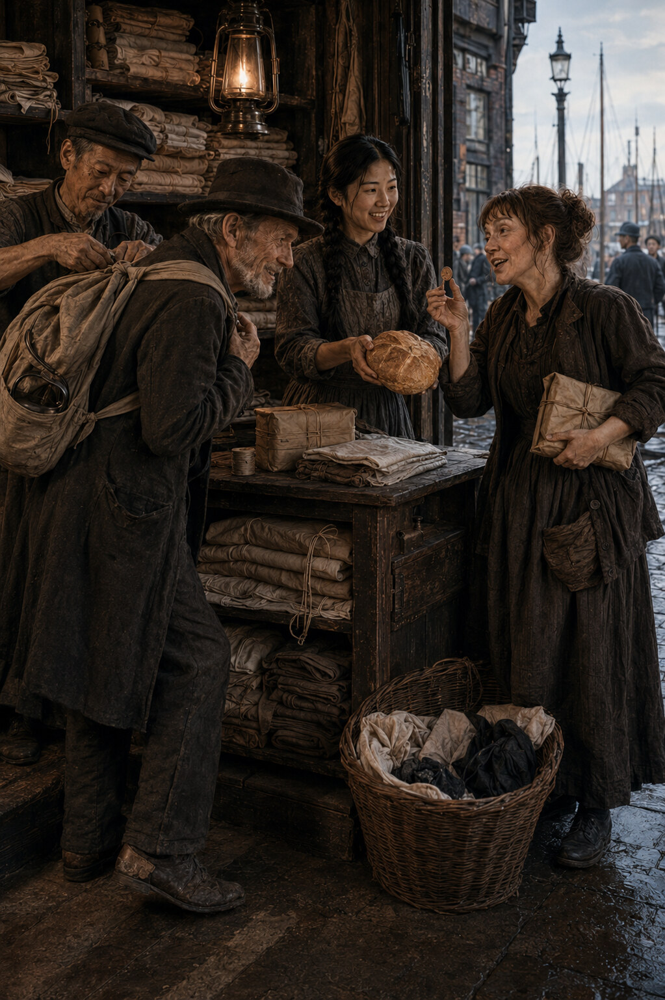

# Chapter Ten: Kate Goes Hopping

*Friday, 7 September 1888*

Kate leaves London with more advice than luggage and more luggage than money.

The advice has accumulated since Aldgate. Walk before the heat. Keep the blanket
dry. Do not let a farmer measure the bin while your back is turned. Never sleep
nearest the barn door. Never sleep furthest from it. Beware the water. Beware the
cider. Beware Kentish men, London men who have reached Kent, and women who claim
to know which is which.

The luggage consists of a blanket, a kettle without a lid, two shirts, Kate's
repaired bodice, John's spare trousers and a loaf already reduced by breakfast.
John Kelly has tied these into a bundle which grows less convincing each time he
touches it.

By the time they reach the Zhangs' shop the blanket trails at one corner and the
kettle strikes John's hip every third step.

Su hears them before the bell. Kate is explaining that the knot has a personal
grudge against her. John says the knot has never met her and therefore cannot yet
have formed an opinion.

They enter together, bringing cold street air and the kettle's complaint.

Morning, duchess, Kate says. We're bound for agriculture.

Agriculture appears to be winning, Su says.

John puts the bundle carefully on the floor. He is a narrow, grey-whiskered man
whose coat has been made for a larger body and worn into agreement with this one.
Su has seen him at Kate's elbow in the Highway and twice asleep upright at the
Prospect, but he has never before entered the laundry. His boots have been patched
at both toes. The left sole opens slightly when he steps, like a mouth considering
whether to speak.

Your father know knots? he asks.

Wei, sorting buttons behind the counter, does not look up.

No.

John nods towards the framed shipping token, the old length of tarred line and the
brass hook Wei has kept from his harbour years.

Thought he might.

Knowing a knot and knowing what you have done to rope are different trades, Wei
says.

He comes round the counter and kneels beside the bundle. One pull releases John's
whole arrangement. Blanket, trousers and kettle spread across the floor.

There, John says to Kate. It was waiting for an expert before it disgraced me.

Wei folds the blanket lengthwise and places the clothes within it. The kettle goes
at the centre with a rag pushed inside to quiet the handle. He makes the bundle
narrow enough to sit across John's shoulders and ties it with two flat turns that
hold without crushing the loaf.

This one slips when I want it to? John asks.

If you know what you want.

That condition ruins most useful things.

Kate has meanwhile removed her coat and put the brown bodice on the counter.

It cannot need mending, Su says.

Such confidence in your own work.

It cannot need mending yet.

The new hooks are secure and the sleeve seam remains straight. Kate turns the
garment inside out and presses two fingers against the lining below the left
breast.

Pocket.

There isn't one.

This is the defect I brought it to you to cure.

You said no more work before Kent.

This is before Kent.

Su looks at her.

Kate looks back with the guileless expression she reserves for statements whose
dishonesty depends upon punctuation.

What sort of pocket?

One a Kent farmer can't see when he tells me I've earned less than I have. Deep
enough for wages, narrow enough not to make me look wealthier than nature
intended.

You're not picking hops in that bodice.

Course not. I pick in the old one. I collect in this.

She produces a square of dark cotton from her coat. It was once part of something
better and has been cut without respect for the grain. Su tests it between finger
and thumb.

Sau-Ling comes through from the yard carrying a tray of blue-streaked collars.
She takes in the bundle, Kate's coat and the bodice on the counter.

You are going today.

If John stops improving the rope.

John has begun testing Wei's knot. He removes his hands.

I was admiring it.

Sau-Ling sets down the tray. You have food?

Kate points at the loaf.

Food after noon?

We're hoping Kent has some.

Sau-Ling turns back into the yard. Kate calls that they require no charity. Sau-
Ling calls that she is looking for none.

Su takes the small scissors from beneath the counter. She trims Kate's cloth into
a long pouch, doubles the upper edge and begins hemming it. The pocket must sit
inside the lining, its opening reached through the bodice front. A clumsy hand
should pass over it. Kate's hand should find it in the dark.

How long? Kate asks.

Longer when you ask.

John settles on the customer stool. There is only one because Kate broke the
second in June and has maintained ever since that sitting revealed a weakness
for which she cannot be blamed. He stretches his left boot ahead of him.

We'll make the road past Lewisham before dinner, he says. Further if the weather
holds.

How far to Hunton? Su asks.

Far enough to regret every pan, Kate says. Near enough to regret leaving one.

Thirty-eight mile, perhaps forty, John says. Depends which man gives directions
and whether he counts the road he wishes existed.

You have work certain?

Certain is a fine word. We have the name of a farm and a man who says they were
taking hands three days ago.

Kate leans her elbows on the counter.

Bins taller than me. Hops all up the poles and the smell fit to make beer out of
the air. Horn goes when they measure. You watch the basket, mind, because a
measure has been known to shrink in a farmer's hand.

You say this every year, John says.

It happens every year.

So does your account of preventing it.

Because I prevent it.

Do you make good money? Su asks.

Kate and John consider one another.

We make Kent money, Kate says.

Which is London money after a long walk, John adds.

The answer contains hope without requiring either of them to trust it. They have
done this before. Su understands that repeated hardship can become a season in a
life and therefore acquire customs, jokes and an expected place at the table. The
yard's winter copper is no less cold because Wei complains of it in the same
words each year.

Sau-Ling returns with a paper parcel and puts it beside the bundle.

Two onion cakes, tea, salt.

Kate starts to object.

For sale, Sau-Ling says. Open account.

We've already got one open.

Then it will not be lonely.

John reaches for his pocket. Sau-Ling covers the parcel with one hand.

After Kent.

He looks to Kate.

Apparently we're rich after Kent.

Rich enough to settle a penny and two cakes, Kate says. Anything beyond that and
we'll buy a railway.

The thought reminds her. She searches her coat, finds the penny and places it
beside Su's wrist.

There. Before I forget what honesty feels like.

Su continues sewing.

After Kent.

I am going to Kent.

You are standing in Limehouse.

At this rate I shall grow old here owing you a penny.

Then I will charge interest.

Kate leaves the coin where it is. Su knots the first seam, turns the pocket and
begins the second. After a moment Kate retrieves the penny and puts it away.

The shop fills briefly with the ordinary sounds of work: thread passing through
cloth, buttons clicking into their wooden divisions, the yard pump, a cart wheel
striking the bad stone outside. John closes his eyes. He is not asleep, but he is
practising.

Kate begins the quay song under her breath.

The waiting girl stands where Su remembers her, looking past the cranes for the
ship. The tide turns. A gull steals something from the quay. This is new and Kate
has to repeat the line until the bird fits the tune. Then comes the returning
vessel, its sails pale in the morning. The girl sees a figure at the rail.

Kate stops.

That's further, Su says.

One gull further.

Who is at the rail?

Could be anybody at that distance.

You still don't know.

I know more than I did Monday.

John opens one eye.

Sailor comes home, finds she's married the landlord, drinks the rent and joins the
navy again.

Kate turns on him. That's not the ending.

It has economy.

It has a landlord. Nothing with a landlord can be a proper song.

Wei says, The sailor drowned before the first verse. The girl is seeing his ghost.

Sau-Ling, carrying the collars away, says, The girl owns the ship.

All three look at her.

Why else would she wait at the quay? she asks.

Kate points after her. That's closer. Put a goat on the ship and Liz might forgive
it.

Su smiles over the seam. The song has gathered endings in three languages and
still refuses all of them. Its missing half is becoming larger than its known
one.

She sets the pocket into the bodice lining with small backstitches. At the lower
corner she adds a second row where the weight of coins will pull. When she is
finished, the opening lies behind the front edge and disappears when the bodice
is fastened.

Kate puts it on behind the hanging cloth. She emerges buttoning her coat over it,
slides her hand inside and produces the penny with a flourish.

John applauds twice.

Again, Su says.

Kate replaces the coin. This time Su watches the cloth rather than the hand.
Nothing shifts outside.

Good, she says.

What do I owe?

The other half.

For a whole pocket?

It is a small pocket.

Kate considers demanding a fairer price. Instead she pats the hidden penny.

I'll ask every picker from here to Maidstone. Someone knows whether that girl has
any sense.

And the old penny?

That too. We shall return burdened by wealth and music.

John stands and lets Wei settle the bundle across his shoulders. The weight pulls
his coat straight. Wei shows him which short end releases the knot and makes him
do it once himself. John reties it correctly.

Learns faster than you, Wei says to Su.

He received a clearer lesson.

He received a less argumentative one.

Kate takes the food parcel from Sau-Ling. For a moment the five of them occupy too
much of the narrow shop: John with the bundle, Kate fastening her coat, Wei
protecting the button trays, Sau-Ling giving instructions about the tea, Su
looking for the scissors she has put beneath her own hand.

Nobody finds a speech worth making.

Mind the bad sole, Su tells John.

It knows the road better than the good one.

Bring back my song, she tells Kate.

Your song now, is it?

Half mine. It is on the slate.

Kate grins and opens the door.

The bell shakes. A drayman outside swears because John turns into his path. Kate
swears more inventively and wins the right of way. They set off west, towards the
roads that will take them south, the kettle silent inside Wei's knot.

Sau-Ling watches until a coal cart passes between them and the window.

They forgot the loaf, she says.

The loaf sits on the counter where Wei removed it from the bundle.

Su picks it up and runs outside.

Kate and John have reached the corner. Su calls once. Kate turns, understands and
comes back at a trot, laughing before she arrives.

Agriculture, she says, taking the loaf, makes terrible demands on the memory.

You would have noticed by noon.

Sooner. John would have eaten the blanket.

She tucks the loaf beneath her arm.

After Kent, duchess.

After Kent.

Kate runs back to John. This time Su does not wait for the corner to empty. A
customer is holding the shop door and asking whether his collars are ready.

They are not. Su tells him when they will be, returns to the counter and enters
the onion cakes beneath Kate's name. The remaining penny is already there in her
smallest writing. Beside it, in a space no proper account requires, she draws a
short line and leaves the rest of the column open.

There is every reason to expect it will be filled.
